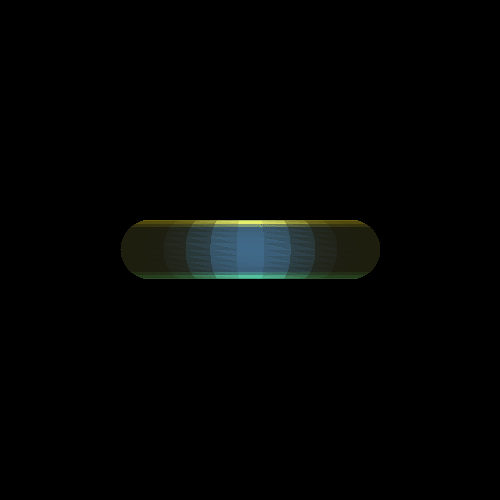

# work 11 Animation

# work 10 MDL

            location: Vec3(250., 400., 0.),
Light locations: 

- (250., 400., 0.) - bright yellow
- (250., 100., 0.) - bright green
- (250., 250., 0.) - bright blue

Uses nom (a parser combinator) to parse mdl file. Each line is parsed individually.

## changes

- Add dependency on `nom` and `thiserror` crates
- Refactor lights module
    - rename to "light"
    - separates original config into Light and LightProps (light properties of an object)
    - implement point lights
