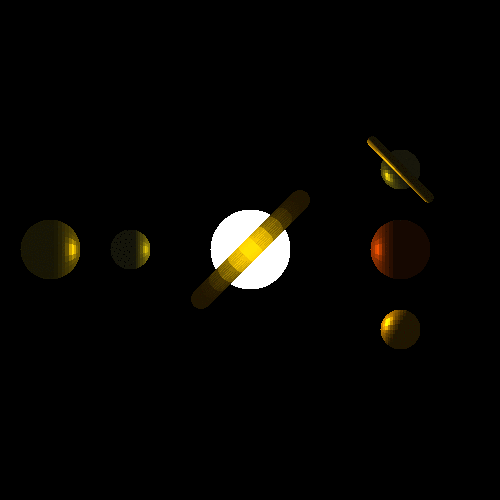

# Work 11 - Animation


3rd return of fakemotion

Note on file name: "d" is for delay, "s" is for step

## Changes

1. add a default writer to Drawer to simplify drawing (maybe stdout?)
2. add animation commands

## Notes

1. For me, the following command does not produce the correct result:
```bash
$ magick simple_100*.png -delay 1.7 img.gif
```
[This](https://bugzilla.redhat.com/show_bug.cgi?id=194554#c3) seems to be the issue.

Solution: put `-delay 1.7` before the src files:

```bash
$ magick -delay 1.7 simple_100-*.png img.gif
```

And the result image animates as expected.

My version of magick:
```bash
$ magick --version
Version: ImageMagick 7.0.10-28 Q16 x64 2020-08-16 http://www.imagemagick.org
Copyright: Copyright (C) 1999-2018 ImageMagick Studio LLC
License: http://www.imagemagick.org/script/license.php
Visual C++: 192628806
Features: Cipher DPC HDRI Modules OpenCL OpenMP(2.0)
Delegates (built-in): bzlib cairo flif freetype gslib heic jng jp2 jpeg lcms lqr lzma openexr pangocairo png ps raw rsvg tiff webp xml zlib
```
2. Common material light parameters [here](http://www.barradeau.com/nicoptere/dump/materials.html)


## Todos

1. possibly, refactor Matrix code into regular matrix and a Mat4 class

# Work 10 - MDL


            location: Vec3(250., 400., 0.),
Light locations: 

- (250., 400., 0.) - bright yellow
- (250., 100., 0.) - bright green
- (250., 250., 0.) - bright blue

Uses nom (a parser combinator) to parse mdl file. Each line is parsed individually.


## Changes

- Add dependency on `nom` and `thiserror` crates
- Refactor lights module
    - rename to "light"
    - separates original config into Light and LightProps (light properties of an object)
    - implement point lights
