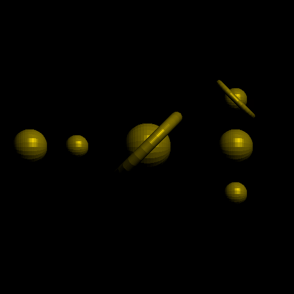

# Lighting

# Changes

- Move bg-color and fg-color away from PPMImg
    - Colors should be set in the drawing fn, and the drawer will keep track
    - Eliminates color getters/setters in interfaces

 - Major refactor for Drawer
    - Now use static dispatch instead of dynamic

 - Fix several very annoying issues:
    - DOT PRODUCT (likely typo in refactoring)
    - RED channel in img controlled by green (likely typo in refactoring too)
    - *IMPORTANT* When generating torus, make sure the inner loop goes through all points: `0..=stesp` instead of `0..steps`

 - And more (can't remember now)

- Resources
    - Lights and shadows: 
        - https://learnopengl.com/Advanced-Lighting/Shadows/Shadow-Mapping
        - https://www.scratchapixel.com/lessons/3d-basic-rendering/introduction-to-shading/ligth-and-shadows